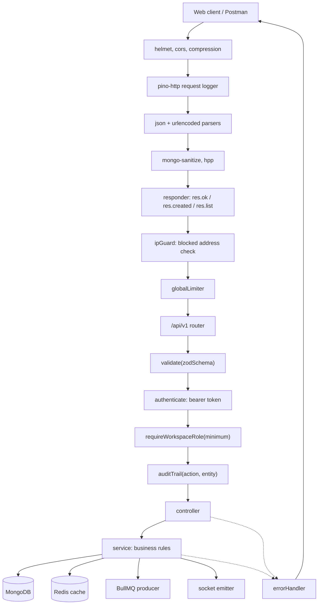
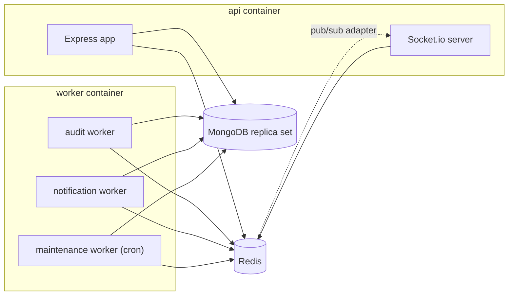
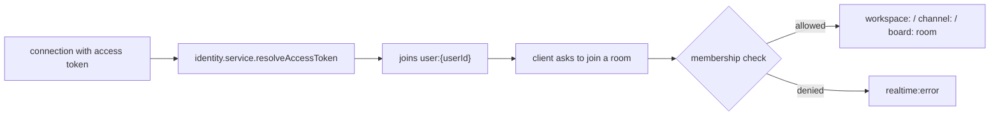

# Architecture

## Request path

Every mutating route runs the same five middlewares in the same order, so reviewing one
route tells you how all of them behave. `auditTrail` registers a `finish` listener rather
than doing work inline, so logging never slows the response and a failed request writes
no audit entry.

## Processes

The API and the workers are the same image with a different command. `RUN_WORKERS_IN_API`
lets a single process do both in development. Socket.io uses the Redis adapter, so several
API replicas can sit behind one load balancer and a broadcast still reaches every client.

## Realtime rooms

The handshake reuses the same token verification as the HTTP middleware, so a revoked
session cannot hold an open socket. Room joins are authorised server side; the client
asking for a room it cannot see gets an error rather than the room.

## Degrading without Redis

Redis is a performance dependency, not a correctness one.

| Concern | With Redis | Without Redis |
| --- | --- | --- |
| Caching | Reads served from cache | Falls through to MongoDB |
| Rate limiting | Counters shared across replicas | Limiter stops counting, requests still served |
| Login lockout | Failures counted per email and IP prefix | Guard opens, password check still applies |
| Background jobs | Queued and retried by workers | Handler runs inline in the request |
| Socket fan out | Broadcast across every replica | Single instance only |

Every Redis call goes through `cache.service.js`, which logs and returns a neutral value
on failure. That is the only place that decides what "Redis is down" means.
