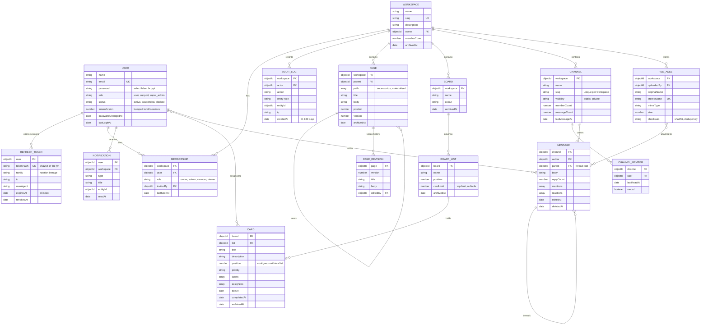

# Data model

## Index choices

| Collection | Index | Why |
| --- | --- | --- |
| users | `email` unique | Login lookup and duplicate rejection |
| users | `name, email` text | Member search |
| refreshtokens | `tokenHash` unique | Rotation looks a token up by hash on every refresh |
| refreshtokens | `expiresAt` TTL | Expired sessions delete themselves |
| memberships | `workspace, user` unique | The authorisation lookup on every workspace request |
| pages | `workspace, parent, position` | Rendering one level of the tree |
| pages | `path` | Finding a whole subtree to move or archive |
| pages | `title, body` text, title weighted 8 | Search ranks a title hit above a body hit |
| pagerevisions | `page, version` unique | One revision per version, and history reads in order |
| cards | `list, position` | Ordering a column |
| cards | `workspace, assignees, dueAt` | "My cards" and the due-soon sweep |
| channels | `workspace, slug` unique | Slug is unique per workspace, not globally |
| messages | `channel, createdAt` | Cursor paging down a channel |
| messages | `workspace, mentions, createdAt` | Mention fan out |
| auditlogs | `workspace, action, createdAt` | The filtered audit query |
| auditlogs | `createdAt` TTL 180d | Retention without a cleanup job |
| notifications | `createdAt` TTL 90d | Same |
| fileassets | `workspace, checksum` | Upload deduplication |

## Where transactions are used

Transactions wrap the writes that touch more than one collection and would leave the data
inconsistent if only half landed.

| Operation | Collections written |
| --- | --- |
| Create workspace | `workspaces`, `memberships` |
| Add or remove a member | `memberships`, `workspaces.memberCount` |
| Transfer ownership | two `memberships`, `workspaces.owner` |
| Update a page | `pagerevisions`, `pages` |
| Move a page | `pages` (the page and every descendant path) |
| Create a board | `boards`, `boardlists` |
| Move a card | `cards` in the source list, the target list, and the card itself |
| Archive a board | `boards`, `boardlists`, `cards` |
| Send or delete a message | `messages`, `channels` counters, parent `replyCount` |

`helpers/transaction.js` asks the deployment once whether it is a replica set or a mongos.
On a standalone MongoDB the same code runs without a session instead of throwing, which
keeps a developer with a plain `mongod` able to work.
